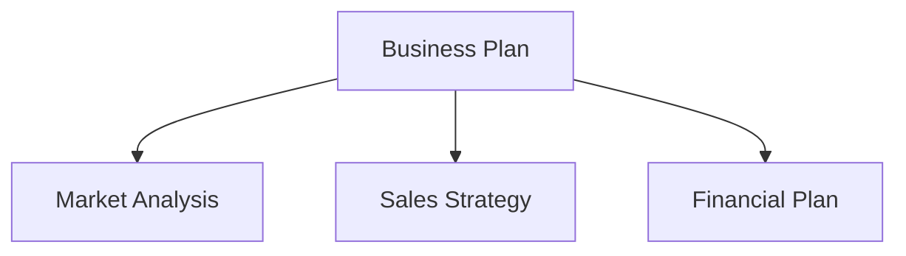

Hier ist eine Anleitung zur Migration einer VitePress-Dokumentationssite zu Astro + Starlight. Wenn Ihre Hauptseite auf Astro läuft, vereinfacht die Zusammenführung Ihrer Dokumentation unter Starlight den Betrieb. Wir behandeln auch die Migration von Mermaid-Diagrammen zum CDN.

## Warum Frameworks vereinheitlichen?

Die Verwendung verschiedener Frameworks für die Hauptseite und die Dokumentationssite erzeugt folgende Probleme:

- **Doppelter Lernaufwand**: Sie müssen sowohl VitePress- als auch Astro-Spezifikationen verstehen
- **Verteilte Abhängigkeiten**: npm-Paketaktualisierungen in zwei separaten Systemen verwaltet
- **Konfigurationsinkonsistenz**: ESLint, Prettier, Deploy-Einstellungen usw. unabhängig gepflegt

Die Vereinheitlichung auf Astro + Starlight ermöglicht die gemeinsame Nutzung von Konfigurationsdateimustern und Troubleshooting-Wissen.

## Migrationsschritte: VitePress zu Starlight

### 1. Projektstruktur-Konvertierung

VitePress platziert Dokumente im `docs/`-Verzeichnis, Starlight verwendet `src/content/docs/`.

```
# Vorher (VitePress)
docs/
  pages/
    index.md
    business-overview.md
    market-analysis.md

# Nachher (Starlight)
src/
  content/
    docs/
      index.md
      business-overview.md
      market-analysis.md
```

### 2. Frontmatter-Anpassungen

VitePress und Starlight haben leicht unterschiedliche Frontmatter-Formate. Wir haben VitePress' `sidebar`-Konfiguration zu Starlights Frontmatter-`sidebar`-Feld migriert.

```yaml
# Starlight frontmatter
---
title: Business Overview
sidebar:
  order: 1
---
```

### 3. astro.config.mjs-Konfiguration

```javascript
import { defineConfig } from 'astro/config'
import starlight from '@astrojs/starlight'

export default defineConfig({
  integrations: [
    starlight({
      title: 'Acecore Business Plan',
      defaultLocale: 'ja',
      sidebar: [
        {
          label: 'Business Plan',
          autogenerate: { directory: '/' },
        },
      ],
    }),
  ],
})
```

### 4. Entfernung von UnoCSS

In der VitePress-Umgebung wurde UnoCSS für benutzerdefinierte Styles verwendet, aber Starlight bietet ausreichende integrierte Standard-Styles. Wir haben `uno.config.ts` und zugehörige Pakete entfernt und die Abhängigkeiten verschlankt.

## Mermaid-Diagramm CDN-Migration

Die Geschäftsplan-Dokumente verwenden Mermaid für Flussdiagramme und Organigramme. In VitePress wurde Mermaid über ein Plugin (`vitepress-plugin-mermaid`) eingebunden, ein solches Plugin existiert für Starlight jedoch nicht.

Daher haben wir zum Laden von Mermaid über CDN auf der Browserseite gewechselt.

### Implementierung

Fügen Sie das Mermaid CDN-Skript zu Starlights benutzerdefiniertem Head hinzu:

```javascript
// astro.config.mjs
starlight({
  head: [
    {
      tag: 'script',
      attrs: { type: 'module' },
      content: `
        import mermaid from 'https://cdn.jsdelivr.net/npm/mermaid@11/dist/mermaid.esm.min.mjs'
        mermaid.initialize({ startOnLoad: true })
      `,
    },
  ],
})
```

Standard-Mermaid-Syntax funktioniert unverändert in Markdown:

````markdown

````

### Vorteile des CDN-Ansatzes

- **Null Build-Abhängigkeiten**: Mermaid als npm-Paket wird nicht mehr benötigt
- **Immer aktuell**: Ruft die neueste Version vom CDN ab
- **Kein SSR erforderlich**: Wird im Browser gerendert, daher keine Auswirkung auf die Build-Zeit

## Migrationsergebnisse

| Punkt | Vorher | Nachher |
| --- | --- | --- |
| Framework | VitePress 1.x | Astro 6 + Starlight |
| CSS | UnoCSS | Starlight integriert |
| Mermaid | vitepress-plugin-mermaid | CDN (jsdelivr) |
| Build-Ausgabe | `docs/.vitepress/dist` | `dist` |
| Deployment | Cloudflare Pages | Cloudflare Pages (unverändert) |

Durch die Framework-Vereinheitlichung können `astro.config.mjs`-Konfigurationsmuster und Deployment-Einstellungen über mehrere Projekte hinweg geteilt werden.

## Fazit

Framework-Vereinheitlichung mag nicht „dringend" sein, aber je länger man betreibt, desto mehr zahlt es sich aus. Die Migration von VitePress zu Starlight kann in wenigen Stunden abgeschlossen werden, und der CDN-Ansatz für Mermaid ist eigentlich eine Befreiung vom Plugin-Management. Wenn Sie mehrere Projekte betreiben, sollten Sie eine Vereinheitlichung Ihres Tech-Stacks in Betracht ziehen.
