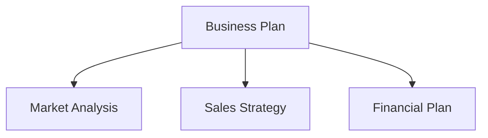

Here's a walkthrough of migrating a VitePress documentation site to Astro + Starlight. If your main site runs on Astro, unifying your docs under Starlight simplifies operations. We also cover migrating Mermaid diagrams to CDN.

## Why Unify Frameworks?

Using different frameworks for the main site and documentation site creates the following problems:

- **Doubled learning costs**: You need to understand both VitePress and Astro specifications
- **Scattered dependencies**: npm package updates managed across two separate systems
- **Configuration inconsistency**: ESLint, Prettier, deploy settings, etc. maintained independently

Unifying on Astro + Starlight enables sharing configuration file patterns and troubleshooting knowledge.

## Migration Steps: VitePress to Starlight

### 1. Project Structure Conversion

VitePress places documents in the `docs/` directory, while Starlight uses `src/content/docs/`.

```
# Before (VitePress)
docs/
  pages/
    index.md
    business-overview.md
    market-analysis.md

# After (Starlight)
src/
  content/
    docs/
      index.md
      business-overview.md
      market-analysis.md
```

### 2. Frontmatter Adjustments

VitePress and Starlight have slightly different frontmatter formats. We migrated VitePress's `sidebar` configuration to Starlight's frontmatter `sidebar` field.

```yaml
# Starlight frontmatter
---
title: Business Overview
sidebar:
  order: 1
---
```

### 3. astro.config.mjs Configuration

```javascript
import { defineConfig } from 'astro/config'
import starlight from '@astrojs/starlight'

export default defineConfig({
  integrations: [
    starlight({
      title: 'Acecore Business Plan',
      defaultLocale: 'ja',
      sidebar: [
        {
          label: 'Business Plan',
          autogenerate: { directory: '/' },
        },
      ],
    }),
  ],
})
```

### 4. Removing UnoCSS

In the VitePress environment, UnoCSS was used for custom styles, but Starlight comes with sufficient built-in default styles. We removed `uno.config.ts` and related packages, slimming down the dependencies.

## Mermaid Diagram CDN Migration

The business plan documents use Mermaid for flowcharts and organizational diagrams. In VitePress, Mermaid was integrated via a plugin (`vitepress-plugin-mermaid`), but no such plugin exists for Starlight.

So we switched to loading Mermaid from a CDN on the browser side.

### Implementation

Add the Mermaid CDN script to Starlight's custom head:

```javascript
// astro.config.mjs
starlight({
  head: [
    {
      tag: 'script',
      attrs: { type: 'module' },
      content: `
        import mermaid from 'https://cdn.jsdelivr.net/npm/mermaid@11/dist/mermaid.esm.min.mjs'
        mermaid.initialize({ startOnLoad: true })
      `,
    },
  ],
})
```

Standard Mermaid syntax works as-is in Markdown:

````markdown

````

### Benefits of the CDN Approach

- **Zero build dependencies**: Mermaid as an npm package is no longer needed
- **Always up to date**: Fetches the latest version from CDN
- **No SSR required**: Rendered in the browser, so no impact on build time

## Migration Results

| Item | Before | After |
| --- | --- | --- |
| Framework | VitePress 1.x | Astro 6 + Starlight |
| CSS | UnoCSS | Starlight built-in |
| Mermaid | vitepress-plugin-mermaid | CDN (jsdelivr) |
| Build output | `docs/.vitepress/dist` | `dist` |
| Deployment | Cloudflare Pages | Cloudflare Pages (unchanged) |

By unifying frameworks, `astro.config.mjs` configuration patterns and deployment settings can be shared across multiple projects.

## Conclusion

Framework unification may not be "urgent," but the longer you operate, the more it pays off. The migration from VitePress to Starlight itself can be completed in a few hours, and the CDN approach for Mermaid is actually a liberation from plugin management. If you're running multiple projects, consider unifying your tech stack.
