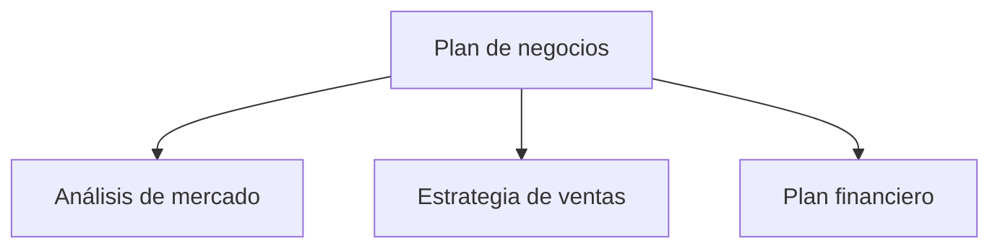

En este artículo resumimos los pasos para migrar un sitio de documentación creado con VitePress a Astro + Starlight. Cuando el sitio principal funciona con Astro, unificar la documentación también en Starlight simplifica la operación. También presentamos la migración de diagramas Mermaid a CDN.

## ¿Por qué unificar el framework?

Cuando el sitio principal y el sitio de documentación usan frameworks diferentes, surgen los siguientes problemas:

- **Duplicación del costo de aprendizaje**: Es necesario conocer las especificaciones tanto de VitePress como de Astro
- **Dispersión de dependencias**: Gestión de actualizaciones de paquetes npm en dos sistemas
- **Inconsistencia de configuración**: Mantenimiento individual de ESLint, Prettier, configuraciones de despliegue, etc.

Al unificar con Astro + Starlight, se pueden compartir patrones de archivos de configuración y conocimientos de resolución de problemas.

## Pasos de migración de VitePress a Starlight

### 1. Conversión de la estructura del proyecto

VitePress coloca los documentos en el directorio `docs/`, mientras que Starlight los coloca en `src/content/docs/`.

```
# Antes (VitePress)
docs/
  pages/
    index.md
    business-overview.md
    market-analysis.md

# Después (Starlight)
src/
  content/
    docs/
      index.md
      business-overview.md
      market-analysis.md
```

### 2. Ajuste del frontmatter

El formato del frontmatter difiere ligeramente entre VitePress y Starlight. Se migró la configuración de `sidebar` de VitePress al campo `sidebar` del frontmatter.

```yaml
# Frontmatter de Starlight
---
title: Resumen del negocio
sidebar:
  order: 1
---
```

### 3. Configuración de astro.config.mjs

```javascript
import { defineConfig } from 'astro/config'
import starlight from '@astrojs/starlight'

export default defineConfig({
  integrations: [
    starlight({
      title: 'Plan de negocios Acecore',
      defaultLocale: 'ja',
      sidebar: [
        {
          label: 'Plan de negocios',
          autogenerate: { directory: '/' },
        },
      ],
    }),
  ],
})
```

### 4. Eliminación de UnoCSS

En el entorno de VitePress se aplicaban estilos personalizados con UnoCSS, pero Starlight incluye estilos predeterminados suficientes. Se eliminó `uno.config.ts` y los paquetes relacionados, reduciendo las dependencias.

## Migración de diagramas Mermaid a CDN

Los documentos del plan de negocios incluyen diagramas de flujo y organigramas escritos con Mermaid. En VitePress se integraba Mermaid mediante un plugin (`vitepress-plugin-mermaid`), pero Starlight no cuenta con un plugin equivalente.

Por ello, se cambió a cargar Mermaid desde CDN en el lado del navegador.

### Implementación

Se añade el script CDN de Mermaid al head personalizado de Starlight.

```javascript
// astro.config.mjs
starlight({
  head: [
    {
      tag: 'script',
      attrs: { type: 'module' },
      content: `
        import mermaid from 'https://cdn.jsdelivr.net/npm/mermaid@11/dist/mermaid.esm.min.mjs'
        mermaid.initialize({ startOnLoad: true })
      `,
    },
  ],
})
```

En Markdown se puede usar la sintaxis de Mermaid tal cual:

````markdown

````

### Ventajas del método CDN

- **Cero dependencias de build**: No se necesita Mermaid como paquete npm
- **Siempre la última versión**: Se obtiene la versión más reciente desde el CDN
- **Sin necesidad de SSR**: Se renderiza en el navegador, sin impacto en el tiempo de build

## Resultado de la migración

| Elemento | Antes | Después |
| --- | --- | --- |
| Framework | VitePress 1.x | Astro 6 + Starlight |
| CSS | UnoCSS | Integrado en Starlight |
| Mermaid | vitepress-plugin-mermaid | CDN (jsdelivr) |
| Directorio de build | `docs/.vitepress/dist` | `dist` |
| Destino de despliegue | Cloudflare Pages | Cloudflare Pages (sin cambios) |

La unificación del framework permite compartir patrones de configuración de `astro.config.mjs` y configuraciones de despliegue entre múltiples proyectos.

## Conclusión

La unificación de frameworks no es algo "urgentemente necesario", pero su beneficio crece cuanto más tiempo dure la operación. La migración de VitePress a Starlight se completa en unas pocas horas, y la migración de Mermaid a CDN incluso supone una liberación de la gestión de plugins. Si opera múltiples proyectos, considere la unificación del stack tecnológico.
