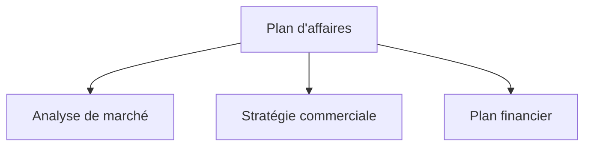

Voici les étapes de la migration d'un site documentaire construit avec VitePress vers Astro + Starlight. Lorsque le site principal fonctionne sous Astro, unifier également la documentation sous Starlight simplifie l'exploitation. La migration CDN des diagrammes Mermaid est également abordée.

## Pourquoi unifier le framework ?

Lorsque le site principal et le site documentaire utilisent des frameworks différents, les problèmes suivants se posent :

- **Double coût d'apprentissage** : Il faut maîtriser les spécifications de VitePress et d'Astro
- **Dispersion des dépendances** : Gérer les mises à jour des packages npm sur deux systèmes
- **Incohérence de la configuration** : Maintenir individuellement ESLint, Prettier, configuration de déploiement, etc.

En unifiant sous Astro + Starlight, on peut mutualiser les patterns de fichiers de configuration et le savoir-faire de dépannage.

## Procédure de migration de VitePress vers Starlight

### 1. Conversion de la structure du projet

VitePress place les documents dans le répertoire `docs/`, Starlight dans `src/content/docs/`.

```
# Avant (VitePress)
docs/
  pages/
    index.md
    business-overview.md
    market-analysis.md

# Après (Starlight)
src/
  content/
    docs/
      index.md
      business-overview.md
      market-analysis.md
```

### 2. Ajustement du frontmatter

Les formats de frontmatter diffèrent légèrement entre VitePress et Starlight. La configuration `sidebar` de VitePress a été migrée vers le champ `sidebar` du frontmatter.

```yaml
# Frontmatter Starlight
---
title: Vue d'ensemble de l'activité
sidebar:
  order: 1
---
```

### 3. Configuration de astro.config.mjs

```javascript
import { defineConfig } from 'astro/config'
import starlight from '@astrojs/starlight'

export default defineConfig({
  integrations: [
    starlight({
      title: 'Plan d\'affaires Acecore',
      defaultLocale: 'ja',
      sidebar: [
        {
          label: 'Plan d\'affaires',
          autogenerate: { directory: '/' },
        },
      ],
    }),
  ],
})
```

### 4. Suppression d'UnoCSS

Dans l'environnement VitePress, UnoCSS était utilisé pour les styles personnalisés, mais Starlight intègre des styles par défaut suffisants. La suppression de `uno.config.ts` et des packages associés a permis d'alléger les dépendances.

## Migration CDN des diagrammes Mermaid

Le document de plan d'affaires utilise Mermaid pour les organigrammes et les diagrammes de flux. Sous VitePress, Mermaid était intégré via un plugin (`vitepress-plugin-mermaid`), mais un tel plugin n'existe pas pour Starlight.

La solution adoptée a été de charger Mermaid côté navigateur depuis un CDN.

### Implémentation

Ajout du script CDN Mermaid dans l'en-tête personnalisé de Starlight.

```javascript
// astro.config.mjs
starlight({
  head: [
    {
      tag: 'script',
      attrs: { type: 'module' },
      content: `
        import mermaid from 'https://cdn.jsdelivr.net/npm/mermaid@11/dist/mermaid.esm.min.mjs'
        mermaid.initialize({ startOnLoad: true })
      `,
    },
  ],
})
```

La syntaxe Mermaid standard dans le Markdown fonctionne telle quelle :

````markdown

````

### Avantages de l'approche CDN

- **Zéro dépendance de build** : Pas besoin de Mermaid en tant que package npm
- **Toujours à jour** : Récupération de la dernière version via CDN
- **Pas de SSR nécessaire** : Le rendu côté navigateur n'impacte pas le temps de build

## Résultat de la migration

| Élément | Avant | Après |
| --- | --- | --- |
| Framework | VitePress 1.x | Astro 6 + Starlight |
| CSS | UnoCSS | Intégré à Starlight |
| Mermaid | vitepress-plugin-mermaid | CDN (jsdelivr) |
| Sortie de build | `docs/.vitepress/dist` | `dist` |
| Hébergement | Cloudflare Pages | Cloudflare Pages (inchangé) |

L'unification du framework permet de mutualiser les patterns de configuration `astro.config.mjs` et les paramètres de déploiement entre plusieurs projets.

## Conclusion

L'unification du framework n'est pas urgente au départ, mais ses bénéfices se renforcent avec le temps. La migration de VitePress vers Starlight se réalise en quelques heures, et la migration CDN de Mermaid apporte même l'avantage de se libérer de la gestion de plugins. Si vous gérez plusieurs projets, envisagez l'unification de votre stack technique.
