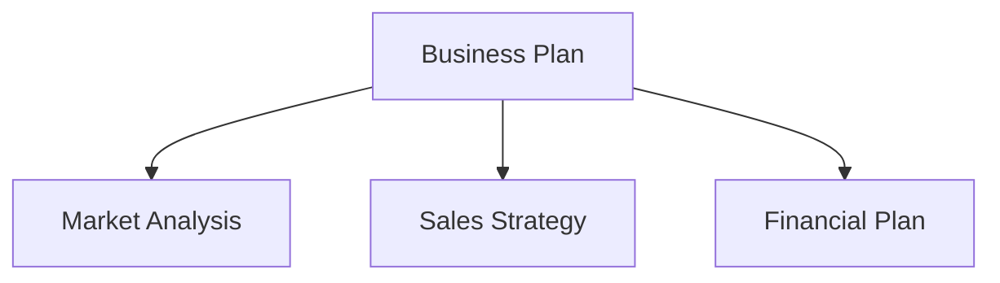

VitePress 문서 사이트를 Astro + Starlight로 마이그레이션하는 과정을 소개합니다. 메인 사이트가 Astro라면 Starlight로 문서를 통합하면 운용이 간소화됩니다. Mermaid 다이어그램의 CDN 이전도 함께 다룹니다.

## 왜 프레임워크를 통합하는가?

메인 사이트와 문서 사이트에서 다른 프레임워크를 사용하면 다음과 같은 문제가 발생합니다:

- **학습 비용이 2배**: VitePress와 Astro 양쪽의 사양을 이해해야 함
- **의존성이 분산**: npm 패키지 업데이트를 별도 시스템으로 관리
- **설정의 불일치**: ESLint, Prettier, 배포 설정 등을 각각 독립적으로 유지보수

Astro + Starlight로 통합하면 설정 파일 패턴과 문제 해결 노하우를 공유할 수 있습니다.

## 마이그레이션 단계: VitePress에서 Starlight로

### 1. 프로젝트 구조 변환

VitePress는 `docs/` 디렉토리에 문서를 배치하고, Starlight는 `src/content/docs/`를 사용합니다.

```
# Before (VitePress)
docs/
  pages/
    index.md
    business-overview.md
    market-analysis.md

# After (Starlight)
src/
  content/
    docs/
      index.md
      business-overview.md
      market-analysis.md
```

### 2. 프론트매터 조정

VitePress와 Starlight는 프론트매터 형식이 약간 다릅니다. VitePress의 `sidebar` 설정을 Starlight의 프론트매터 `sidebar` 필드로 마이그레이션했습니다.

```yaml
# Starlight frontmatter
---
title: Business Overview
sidebar:
  order: 1
---
```

### 3. astro.config.mjs 설정

```javascript
import { defineConfig } from 'astro/config'
import starlight from '@astrojs/starlight'

export default defineConfig({
  integrations: [
    starlight({
      title: 'Acecore Business Plan',
      defaultLocale: 'ja',
      sidebar: [
        {
          label: 'Business Plan',
          autogenerate: { directory: '/' },
        },
      ],
    }),
  ],
})
```

### 4. UnoCSS 제거

VitePress 환경에서는 커스텀 스타일링에 UnoCSS를 사용했지만, Starlight는 충분한 내장 기본 스타일을 갖추고 있습니다. `uno.config.ts`와 관련 패키지를 제거하여 의존성을 슬림화했습니다.

## Mermaid 다이어그램 CDN 이전

사업계획서에서는 Mermaid를 사용하여 플로우차트와 조직도를 작성합니다. VitePress에서는 플러그인(`vitepress-plugin-mermaid`)으로 통합했지만, Starlight에는 이런 플러그인이 존재하지 않습니다.

그래서 브라우저 측에서 CDN으로 Mermaid를 로딩하는 방식으로 전환했습니다.

### 구현

Starlight의 커스텀 head에 Mermaid CDN 스크립트를 추가합니다:

```javascript
// astro.config.mjs
starlight({
  head: [
    {
      tag: 'script',
      attrs: { type: 'module' },
      content: `
        import mermaid from 'https://cdn.jsdelivr.net/npm/mermaid@11/dist/mermaid.esm.min.mjs'
        mermaid.initialize({ startOnLoad: true })
      `,
    },
  ],
})
```

Markdown에서 표준 Mermaid 문법을 그대로 사용할 수 있습니다:

````markdown

````

### CDN 방식의 이점

- **빌드 의존성 제로**: Mermaid를 npm 패키지로 설치할 필요 없음
- **항상 최신**: CDN에서 최신 버전을 가져옴
- **SSR 불필요**: 브라우저에서 렌더링하므로 빌드 시간에 영향 없음

## 마이그레이션 결과

| 항목 | 이전 | 이후 |
| --- | --- | --- |
| 프레임워크 | VitePress 1.x | Astro 6 + Starlight |
| CSS | UnoCSS | Starlight 내장 |
| Mermaid | vitepress-plugin-mermaid | CDN (jsdelivr) |
| 빌드 출력 | `docs/.vitepress/dist` | `dist` |
| 배포 | Cloudflare Pages | Cloudflare Pages (변경 없음) |

프레임워크 통합으로 `astro.config.mjs` 설정 패턴과 배포 설정을 여러 프로젝트에서 공유할 수 있게 되었습니다.

## 결론

프레임워크 통합은 "긴급"하지 않을 수 있지만, 운용 기간이 길어질수록 효과가 커집니다. VitePress에서 Starlight로의 마이그레이션 자체는 몇 시간이면 완료할 수 있으며, Mermaid의 CDN 방식은 오히려 플러그인 관리에서의 해방입니다. 여러 프로젝트를 운용하고 있다면 기술 스택 통합을 검토해 보세요.
