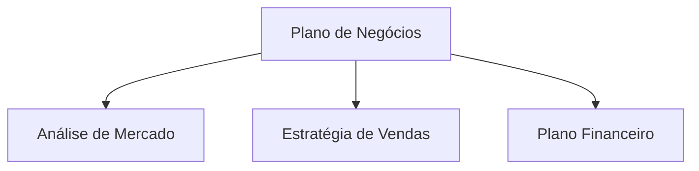

Resumimos o procedimento para migrar um site de documentação criado com VitePress para Astro + Starlight. Quando o site principal roda em Astro, unificar a documentação no Starlight simplifica a operação. Também apresentamos a migração dos diagramas Mermaid para CDN.

## Por que unificar o framework

Quando o site principal e o site de documentação usam frameworks diferentes, surgem os seguintes problemas:

- **Duplicação do custo de aprendizado**: É necessário conhecer as especificações tanto do VitePress quanto do Astro
- **Dispersão de dependências**: Gerenciamento de atualizações de pacotes npm em dois sistemas
- **Consistência de configuração**: Manutenção individual de ESLint, Prettier, configurações de deploy etc.

Ao unificar com Astro + Starlight, é possível compartilhar padrões de arquivos de configuração e conhecimentos de troubleshooting.

## Procedimento de migração do VitePress para o Starlight

### 1. Conversão da estrutura do projeto

VitePress coloca os documentos no diretório `docs/`, enquanto Starlight usa `src/content/docs/`.

```
# Antes (VitePress)
docs/
  pages/
    index.md
    business-overview.md
    market-analysis.md

# Depois (Starlight)
src/
  content/
    docs/
      index.md
      business-overview.md
      market-analysis.md
```

### 2. Ajuste do frontmatter

O formato do frontmatter difere ligeiramente entre VitePress e Starlight. A configuração de `sidebar` do VitePress foi migrada para o campo `sidebar` do frontmatter.

```yaml
# Frontmatter do Starlight
---
title: Visão geral do negócio
sidebar:
  order: 1
---
```

### 3. Configuração do astro.config.mjs

```javascript
import { defineConfig } from 'astro/config'
import starlight from '@astrojs/starlight'

export default defineConfig({
  integrations: [
    starlight({
      title: 'Plano de Negócios Acecore',
      defaultLocale: 'ja',
      sidebar: [
        {
          label: 'Plano de Negócios',
          autogenerate: { directory: '/' },
        },
      ],
    }),
  ],
})
```

### 4. Remoção do UnoCSS

No ambiente VitePress, estilos personalizados eram aplicados com UnoCSS, mas o Starlight possui estilos padrão suficientes embutidos. Removemos `uno.config.ts` e pacotes relacionados, reduzindo as dependências.

## Migração da Mermaid para CDN

Os documentos do plano de negócios descrevem fluxogramas e organogramas em Mermaid. No VitePress, a Mermaid era integrada via plugin (`vitepress-plugin-mermaid`), mas não existe plugin equivalente para o Starlight.

Assim, mudamos para carregar a Mermaid via CDN no lado do navegador.

### Implementação

Adicionamos o script CDN da Mermaid ao cabeçalho personalizado do Starlight.

```javascript
// astro.config.mjs
starlight({
  head: [
    {
      tag: 'script',
      attrs: { type: 'module' },
      content: `
        import mermaid from 'https://cdn.jsdelivr.net/npm/mermaid@11/dist/mermaid.esm.min.mjs'
        mermaid.initialize({ startOnLoad: true })
      `,
    },
  ],
})
```

No Markdown, a notação padrão da Mermaid funciona normalmente:

````markdown

````

### Benefícios da abordagem CDN

- **Zero dependências de build**: Mermaid como pacote npm não é necessário
- **Sempre na versão mais recente**: Obtém a versão mais recente via CDN
- **SSR desnecessário**: Renderização no navegador, sem impacto no tempo de build

## Resultado da migração

| Item | Antes | Depois |
| --- | --- | --- |
| Framework | VitePress 1.x | Astro 6 + Starlight |
| CSS | UnoCSS | Estilização integrada do Starlight |
| Mermaid | vitepress-plugin-mermaid | CDN (jsdelivr) |
| Saída do build | `docs/.vitepress/dist` | `dist` |
| Hospedagem | Cloudflare Pages | Cloudflare Pages (sem alteração) |

Com a unificação do framework, é possível compartilhar padrões de configuração do `astro.config.mjs` e configurações de deploy entre múltiplos projetos.

## Conclusão

A unificação de frameworks pode não ser "urgente", mas quanto mais longa a operação, maior o benefício. A migração do VitePress para o Starlight pode ser concluída em poucas horas, e a migração da Mermaid para CDN é até um benefício — a liberação da gestão de plugins. Se você opera múltiplos projetos, considere unificar a stack tecnológica.
