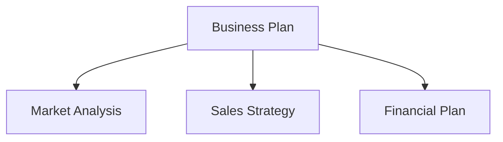

Вот пошаговое описание миграции документационного сайта VitePress на Astro + Starlight. Если ваш основной сайт работает на Astro, унификация документации под Starlight упрощает эксплуатацию. Также рассматривается миграция диаграмм Mermaid на CDN.

## Зачем унифицировать фреймворки?

Использование различных фреймворков для основного сайта и документационного сайта создаёт следующие проблемы:

- **Удвоенные затраты на обучение**: Нужно разбираться и в спецификациях VitePress, и в Astro
- **Рассредоточенные зависимости**: Обновления npm-пакетов управляются в двух отдельных системах
- **Несогласованность конфигурации**: ESLint, Prettier, настройки деплоя и т.д. поддерживаются независимо

Унификация на Astro + Starlight позволяет делиться паттернами конфигурационных файлов и знаниями по устранению неполадок.

## Шаги миграции: VitePress на Starlight

### 1. Преобразование структуры проекта

VitePress размещает документы в каталоге `docs/`, а Starlight использует `src/content/docs/`.

```
# Before (VitePress)
docs/
  pages/
    index.md
    business-overview.md
    market-analysis.md

# After (Starlight)
src/
  content/
    docs/
      index.md
      business-overview.md
      market-analysis.md
```

### 2. Корректировка frontmatter

VitePress и Starlight имеют немного различающиеся форматы frontmatter. Мы мигрировали конфигурацию `sidebar` VitePress в поле frontmatter `sidebar` Starlight.

```yaml
# Starlight frontmatter
---
title: Business Overview
sidebar:
  order: 1
---
```

### 3. Конфигурация astro.config.mjs

```javascript
import { defineConfig } from 'astro/config'
import starlight from '@astrojs/starlight'

export default defineConfig({
  integrations: [
    starlight({
      title: 'Acecore Business Plan',
      defaultLocale: 'ja',
      sidebar: [
        {
          label: 'Business Plan',
          autogenerate: { directory: '/' },
        },
      ],
    }),
  ],
})
```

### 4. Удаление UnoCSS

В среде VitePress UnoCSS использовался для пользовательских стилей, но Starlight поставляется с достаточными встроенными стилями по умолчанию. Мы удалили `uno.config.ts` и связанные пакеты, облегчив зависимости.

## Миграция диаграмм Mermaid на CDN

В документах бизнес-плана используется Mermaid для блок-схем и организационных диаграмм. В VitePress Mermaid был интегрирован через плагин (`vitepress-plugin-mermaid`), но такого плагина для Starlight не существует.

Поэтому мы перешли на загрузку Mermaid с CDN на стороне браузера.

### Реализация

Добавьте CDN-скрипт Mermaid в пользовательский head Starlight:

```javascript
// astro.config.mjs
starlight({
  head: [
    {
      tag: 'script',
      attrs: { type: 'module' },
      content: `
        import mermaid from 'https://cdn.jsdelivr.net/npm/mermaid@11/dist/mermaid.esm.min.mjs'
        mermaid.initialize({ startOnLoad: true })
      `,
    },
  ],
})
```

Стандартный синтаксис Mermaid работает в Markdown как есть:

````markdown

````

### Преимущества подхода CDN

- **Нулевые зависимости сборки**: Mermaid как npm-пакет больше не нужен
- **Всегда актуальная версия**: Загружается последняя версия с CDN
- **Не требуется SSR**: Рендерится в браузере, поэтому не влияет на время сборки

## Результаты миграции

| Пункт | До | После |
| --- | --- | --- |
| Фреймворк | VitePress 1.x | Astro 6 + Starlight |
| CSS | UnoCSS | Встроенные стили Starlight |
| Mermaid | vitepress-plugin-mermaid | CDN (jsdelivr) |
| Выходные файлы сборки | `docs/.vitepress/dist` | `dist` |
| Деплой | Cloudflare Pages | Cloudflare Pages (без изменений) |

Благодаря унификации фреймворков паттерны конфигурации `astro.config.mjs` и настройки деплоя могут быть общими для нескольких проектов.

## Заключение

Унификация фреймворков может не быть «срочной», но чем дольше вы эксплуатируете проекты, тем больше она окупается. Сама миграция с VitePress на Starlight может быть завершена за несколько часов, а подход CDN для Mermaid фактически освобождает от управления плагинами. Если вы ведёте несколько проектов, рассмотрите унификацию технологического стека.
