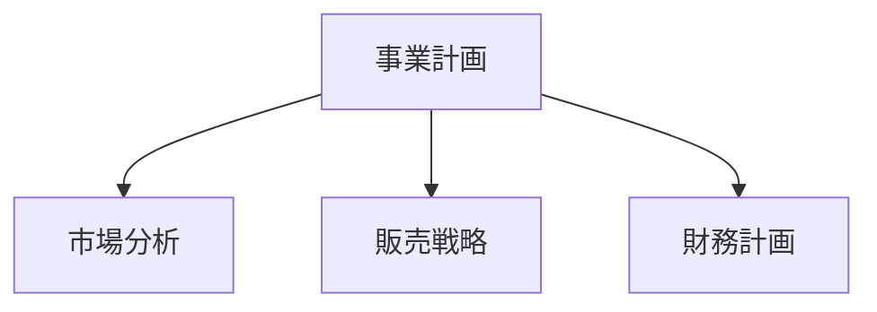

VitePress で作ったドキュメントサイトを、Astro + Starlight に移行する手順をまとめます。メインサイトが Astro で動いている場合、ドキュメントも Starlight に統一すると運用がシンプルになります。Mermaid 図表の CDN 移行についても紹介します。

## なぜフレームワークを統一するのか

メインサイトとドキュメントサイトで異なるフレームワークを使っていると、以下の問題が発生します：

- **学習コストの二重化**：VitePress と Astro の両方の仕様を把握する必要がある
- **依存の分散**：npm パッケージの更新を2系統で管理
- **設定の一貫性**：ESLint、Prettier、デプロイ設定などを個別に維持

Astro + Starlight に統一することで、設定ファイルのパターン化やトラブルシューティングの知見を共有できるようになります。

## VitePress から Starlight への移行手順

### 1. プロジェクト構造の変換

VitePress はドキュメントを `docs/` ディレクトリに、Starlight は `src/content/docs/` に配置します。

```
# 変更前（VitePress）
docs/
  pages/
    index.md
    business-overview.md
    market-analysis.md

# 変更後（Starlight）
src/
  content/
    docs/
      index.md
      business-overview.md
      market-analysis.md
```

### 2. フロントマターの調整

VitePress と Starlight ではフロントマターの形式が微妙に異なります。VitePress の `sidebar` 設定をフロントマターの `sidebar` フィールドに移行しました。

```yaml
# Starlight のフロントマター
---
title: 事業概要
sidebar:
  order: 1
---
```

### 3. astro.config.mjs の設定

```javascript
import { defineConfig } from 'astro/config'
import starlight from '@astrojs/starlight'

export default defineConfig({
  integrations: [
    starlight({
      title: 'Acecore 事業計画',
      defaultLocale: 'ja',
      sidebar: [
        {
          label: '事業計画',
          autogenerate: { directory: '/' },
        },
      ],
    }),
  ],
})
```

### 4. UnoCSS の削除

VitePress 環境では UnoCSS でカスタムスタイルを適用していましたが、Starlight には十分なデフォルトスタイルが組み込まれています。`uno.config.ts` と関連パッケージを削除し、依存をスリム化しました。

## Mermaid 図表の CDN 移行

事業計画ドキュメントにはフローチャートや組織図を Mermaid で記述しています。VitePress ではプラグイン（`vitepress-plugin-mermaid`）で Mermaid を統合していましたが、Starlight にはそのようなプラグインがありません。

そこで、Mermaid をブラウザサイドで CDN から読み込む方式に切り替えました。

### 実装方法

Starlight のカスタムヘッドに Mermaid の CDN スクリプトを追加します。

```javascript
// astro.config.mjs
starlight({
  head: [
    {
      tag: 'script',
      attrs: { type: 'module' },
      content: `
        import mermaid from 'https://cdn.jsdelivr.net/npm/mermaid@11/dist/mermaid.esm.min.mjs'
        mermaid.initialize({ startOnLoad: true })
      `,
    },
  ],
})
```

Markdown 内では通常の Mermaid 記法がそのまま使えます：

````markdown

````

### CDN 方式のメリット

- **ビルド依存ゼロ**：npm パッケージとしての Mermaid が不要
- **常に最新バージョン**：CDN から最新版を取得
- **SSR 不要**：ブラウザで描画するためビルド時間に影響しない

## 移行結果

| 項目 | Before | After |
|------|--------|-------|
| フレームワーク | VitePress 1.x | Astro 6 + Starlight |
| CSS | UnoCSS | Starlight 組み込み |
| Mermaid | vitepress-plugin-mermaid | CDN（jsdelivr） |
| ビルド出力先 | `docs/.vitepress/dist` | `dist` |
| デプロイ先 | Cloudflare Pages | Cloudflare Pages（変更なし） |

フレームワークの統一により、`astro.config.mjs` の設定パターンやデプロイ設定を複数プロジェクト間で共有できるようになります。

## まとめ

フレームワーク統一は「今すぐ必要」ではなくても、運用が長くなるほど効いてくる施策です。VitePress から Starlight への移行自体は数時間で完了でき、Mermaid の CDN 化はむしろプラグイン管理からの解放というメリットがあります。複数プロジェクトを運用している方は、技術スタックの統一を検討してみてください。
