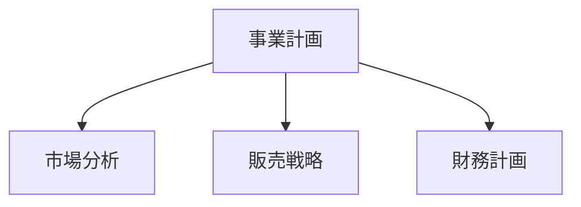

本文总结了将使用 VitePress 创建的文档站点迁移到 Astro + Starlight 的步骤。如果主站使用 Astro，将文档也统一到 Starlight 可以简化运维。同时也介绍了 Mermaid 图表的 CDN 迁移。

## 为什么要统一框架

当主站和文档站点使用不同的框架时，会出现以下问题：

- **学习成本翻倍**：需要同时掌握 VitePress 和 Astro 的规范
- **依赖分散**：需要在两套系统中管理 npm 包的更新
- **配置不一致**：需要分别维护 ESLint、Prettier、部署配置等

统一到 Astro + Starlight 后，可以共享配置文件模式和故障排除经验。

## 从 VitePress 迁移到 Starlight 的步骤

### 1. 项目结构转换

VitePress 将文档放在 `docs/` 目录，Starlight 放在 `src/content/docs/`。

```
# 变更前（VitePress）
docs/
  pages/
    index.md
    business-overview.md
    market-analysis.md

# 变更后（Starlight）
src/
  content/
    docs/
      index.md
      business-overview.md
      market-analysis.md
```

### 2. 调整 frontmatter

VitePress 和 Starlight 的 frontmatter 格式略有不同。将 VitePress 的 `sidebar` 配置迁移到 frontmatter 的 `sidebar` 字段。

```yaml
# Starlight 的 frontmatter
---
title: 事業概要
sidebar:
  order: 1
---
```

### 3. astro.config.mjs 的配置

```javascript
import { defineConfig } from 'astro/config'
import starlight from '@astrojs/starlight'

export default defineConfig({
  integrations: [
    starlight({
      title: 'Acecore 事業計画',
      defaultLocale: 'ja',
      sidebar: [
        {
          label: '事業計画',
          autogenerate: { directory: '/' },
        },
      ],
    }),
  ],
})
```

### 4. 移除 UnoCSS

VitePress 环境中使用 UnoCSS 应用自定义样式，但 Starlight 内置了完善的默认样式。删除 `uno.config.ts` 及相关包，精简依赖。

## Mermaid 图表的 CDN 迁移

事业计划文档中使用 Mermaid 编写了流程图和组织架构图。VitePress 通过插件（`vitepress-plugin-mermaid`）集成 Mermaid，但 Starlight 没有类似的插件。

因此改为在浏览器端通过 CDN 加载 Mermaid。

### 实现方法

在 Starlight 的自定义 head 中添加 Mermaid 的 CDN 脚本。

```javascript
// astro.config.mjs
starlight({
  head: [
    {
      tag: 'script',
      attrs: { type: 'module' },
      content: `
        import mermaid from 'https://cdn.jsdelivr.net/npm/mermaid@11/dist/mermaid.esm.min.mjs'
        mermaid.initialize({ startOnLoad: true })
      `,
    },
  ],
})
```

Markdown 中可以直接使用常规的 Mermaid 语法：

````markdown

````

### CDN 方式的优势

- **零构建依赖**：不需要将 Mermaid 作为 npm 包安装
- **始终使用最新版本**：从 CDN 获取最新版
- **无需 SSR**：在浏览器端渲染，不影响构建时间

## 迁移结果

| 项目           | Before                   | After                        |
| -------------- | ------------------------ | ---------------------------- |
| 框架 | VitePress 1.x            | Astro 6 + Starlight          |
| CSS            | UnoCSS                   | Starlight 内置           |
| Mermaid        | vitepress-plugin-mermaid | CDN（jsdelivr）              |
| 构建输出目录   | `docs/.vitepress/dist`   | `dist`                       |
| 部署目标     | Cloudflare Pages         | Cloudflare Pages（未变更） |

通过统一框架，可以在多个项目间共享 `astro.config.mjs` 的配置模式和部署配置。

## 总结

框架统一即使"不是马上需要"，随着运维时间的增长也会逐渐发挥效果。从 VitePress 迁移到 Starlight 本身可以在几小时内完成，Mermaid 的 CDN 化反而带来了从插件管理中解放的好处。如果您正在运维多个项目，不妨考虑统一技术栈。
